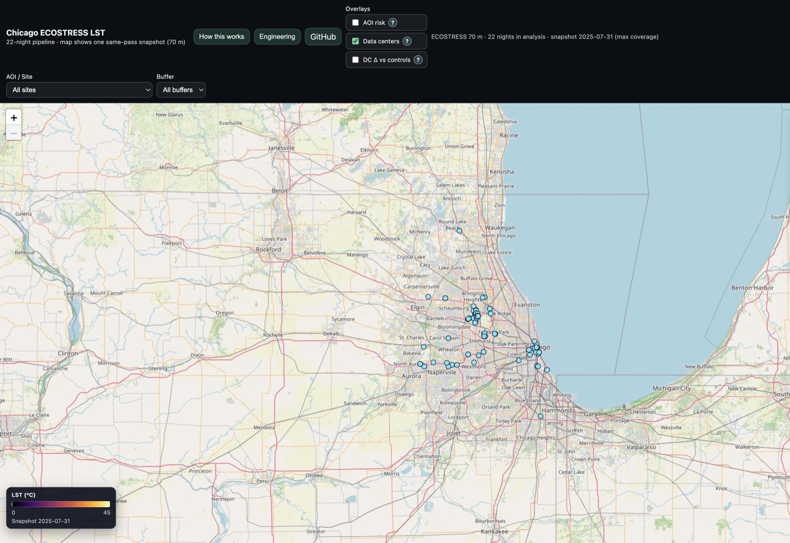
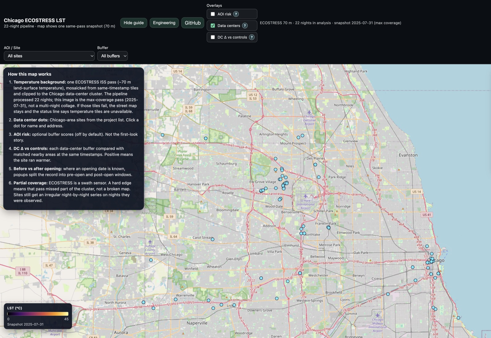

## Chicago ECOSTRESS LST

Public ECOSTRESS land-surface-temperature pipeline (QC, °C, COG) over **22 Chicago nights**, plus a Leaflet map whose background is **one same-pass snapshot**.

**Live app:** `https://charlotteprevost.github.io/chicago_lst/frontend/`

The map pixels are the 2025-07-31 ISS overpass (~70 m) that covered all **113** mapped data-center sites. It is not a live feed and does not mix nights. Site stats and the optional DC Δ overlay use the multi-night series (median 10 observations per site). A remaining swath edge means that pass missed part of the cluster.

## Portfolio quick view

### Screenshots




### Demo

| Step | Time | Action | What to highlight |
|------|------|--------|-------------------|
| 1 | 5–8s | Open the [live map](https://charlotteprevost.github.io/chicago_lst/frontend/) | Title **Chicago ECOSTRESS LST**; colorbar 0–45 °C |
| 2 | 8–12s | Read the status line + colorbar date | 22 nights in analysis; snapshot **2025-07-31** (max coverage) |
| 3 | 8–12s | Data-center dots (on by default) | 113 mapped sites; leave **AOI risk** off |
| 4 | 5s | Click **GitHub** | QC → °C → same-pass COG → Pages / R2 |

### Demo (local)

1. **Serve the repo root** so `frontend/` can fetch `data/`: `python3 -m http.server 8080`
2. **Open the app:** `http://localhost:8080/frontend/`
3. **Tiles:** Pages deploy bakes static XYZ. Locally, TiTiler on Render may cold-start; the street map and colorbar stay if tiles fail.

---

## 1) Purpose

### Example case use

**Are neighborhoods around data centers staying hotter at night than comparable nearby areas?**

The app combines satellite-derived thermal data with mapped data center locations and shows three overlays:

- **Area of interest (AOI) risk**: a simple heat-risk score for each mapped area.
- **Data centers**: known data center locations used in the analysis.
- **Data Center delta vs controls**: how much warmer/cooler each data-center buffer is compared with matched non-data-center control buffers at the same timestamps.

### How to read it

- Higher positive Δ values mean data-center areas were warmer than matched controls.
- Values near zero mean little difference.
- Negative values mean data-center areas were cooler than matched controls.

### What this app is _not_

- It does **not** prove causality by itself.
- It is an observational, geospatial comparison workflow.
- Results depend on data availability, cloud conditions, quality masks, and source completeness.

---

## 2) Developer guide

### Repo structure

- `frontend/`: static web app (Leaflet map UI)
- `data/`: small web-ready artifacts (`*.geojson`, metadata json)
- `analysis/`: data processing and geospatial/statistical pipeline
- `backend/`: TiTiler container for serving COG tiles

### Recommended hosting model

- **Frontend**: GitHub Pages (static)
- **Backend**: Render (TiTiler for COG tiles)

### Quick start (local analysis)

From `analysis/`:

```bash
python3 -m venv .venv              # create local virtual environment
source .venv/bin/activate          # activate the environment
pip install -r requirements.txt    # install analysis dependencies
```

To run Chicago ECOSTRESS study (fetch bbox defaults to the DC hull + 10 km):

```bash
python 23_run_il_ecostress_dc_study.py \
  --data_centers ../data/chicago_data_centers_183.geojson \
  --start 2025-07-01 \
  --end 2025-07-31 \
  --buffers_m 250,500,1000 \
  --outputs_dir outputs_ecostress_il_qc
# --data_centers: input data center points
# --start/--end: analysis date window (UTC)
# --buffers_m: buffer distances in meters
# --outputs_dir: folder for generated outputs
```

To build DC effect GeoJSON for the web map:

```bash
python 06_export_dc_effect_geojson.py \
  --config outputs_ecostress_il_qc/config.ecostress_il.generated.json \
  --out ../data/dc_effect_cumulative.geojson
# --config: generated pipeline config from the study run
# --out: GeoJSON consumed by the frontend effect overlay
```

### To publish to GitHub Pages

1. Set repository Pages source to **GitHub Actions**.
2. Push to `main`.
3. Workflow `.github/workflows/pages.yml` publishes `frontend/` and `data/`.
4. Public URL: `https://charlotteprevost.github.io/chicago_lst/frontend/`
   The Pages workflow also bakes a static XYZ PNG pyramid (z6–z10) from the public COG when GDAL/rasterio is available, so first paint does not wait on Render.

### To publish to Render (TiTiler)

1. Create Render service from this repo using `render.yaml`.
2. Use `backend/` as service root (`rootDir: backend` in `render.yaml`).
3. Health check path is `/`.
4. Put your service URL in `frontend/config.js` as `titilerBaseUrl`.

### To use high-res ECOSTRESS LST in the app:

1. Build a COG from raster(s) in `analysis/` (`24_make_ecostress_cog.py` or `25_publish_latest_ecostress_cog.py`).
2. Host COG at a public URL that supports byte-range requests.
3. Update `data/ecostress_highres_latest.json` with that COG URL and optional `scene_time`.
4. Prefer a static XYZ pyramid (`26_bake_ecostress_xyz.py`) so the map does not wait on TiTiler. GitHub Pages bakes z6–z10 on deploy. Locally:

```bash
python 26_bake_ecostress_xyz.py \
  --cog /vsicurl/https://pub-35e731c3513942bd8c03f959efee69d1.r2.dev/ecostress_il_lst_70m_latest.cog.tif \
  --out-dir ../data/tiles/ecostress \
  --min-zoom 6 \
  --max-zoom 10 \
  --public-tiles-url "../data/tiles/ecostress/{z}/{x}/{y}.png" \
  --scene-time 2025-07-31T18:05:13Z
# --cog: local path or /vsicurl/<https COG>
# --out-dir: XYZ root {z}/{x}/{y}.png (WebMercatorQuad, EPSG:3857)
# --public-tiles-url: template written into data/ecostress_highres_latest.json
```

5. If `tiles_url` is missing or the probe tile 404s, the app falls back to TiTiler (`/cog/...`). If that fails, the OSM basemap stays and the status line reports that temperature tiles are unavailable.

---

## 3) Methods: sources/math/stats/assumptions

## Data sources

### Thermal imagery and map tiles

- **ECOSTRESS L2T LST (primary high-resolution thermal source)**
  - Accessed via Earthdata tooling in `analysis/22_fetch_ecostress_l2t_il.py`
  - Typical resolution used in this project: ~70 m LST tiles
  - Web map: one same-pass mosaic clipped to the Chicago data-center cluster (`analysis/25_publish_latest_ecostress_cog.py`, `data/chicago_dc_aoi.json`)
- **OpenStreetMap** basemap. If ECOSTRESS tiles fail, the street map stays and the status line reports that temperature tiles are unavailable (no second satellite product).

### Data center locations

- Source list page:
  - `https://www.datacentermap.com/usa/illinois/chicago/`
- Raw paste archive:
  - `data/chicago_data_centers_183_source.txt`
- Parsed table:
  - `data/chicago_data_centers_183.csv`
- Geocoded points:
  - `data/chicago_data_centers_183.geojson`

### Derived overlays served to frontend

- `data/aoi_risk_latest.geojson` (risk scoring overlay)
- `data/dc_effect_cumulative.geojson` (data center vs control effect overlay)
- `data/ecostress_highres_latest.json` (current COG pointer for TiTiler)

### Optional covariates (advanced modeling)

The analysis pipeline includes optional covariate extraction/matching steps (`32+` scripts) and manifest builders; see `analysis/README.md` for full covariate workflow details.

## Processing and QC pipeline

### Core workflow

1. Generate AOI buffers around data-center points and matched control points.
2. Fetch ECOSTRESS tiles for the requested date range.
3. Extract zonal statistics for each AOI and timestamp.
4. Apply quality controls and convert Kelvin to Celsius.
5. Compute risk and comparative metrics.
6. Export GeoJSON overlays for the web map.

### Quality control and transforms

Implemented in generated config and extraction scripts:

- **Unit conversion**: `degC = Kelvin - 273.15`
- **QC masking defaults**:
  - keep clear-sky pixels (`cloud == 0`)
  - keep non-water pixels (`water == 0`)
  - keep QC classes `[0, 1]` with `qc_class_bitmask = 3`
- Companion masks referenced by filename convention:
  - `*_cloud.tif`, `*_water.tif`, `*_QC.tif`

## Math & statistics used

### A) Risk/anomaly layer (`analysis/02_compute_anomaly_and_risk.py`)

For each AOI and baseline group (month or day-of-year):

- `baseline_mean = mean(mean_temperature)`
- `baseline_std = std(mean_temperature)`
- `baseline_p90 = 90th percentile(mean_temperature)`

For each observation:

- `anomaly = mean - baseline_mean`
- `z = anomaly / baseline_std`
- `is_hot_night = 1 if mean > baseline_p90 else 0`

Trend:

- Fit linear model `y = a + b*t` where:
  - `y` is AOI mean temperature
  - `t` is years since first observation
  - `trend_c_per_year = b`

Recent hot-night frequency:

- `hot_nights_14 = sum(is_hot_night over latest 14 observations)`

Risk score (clipped to 0..100):

- `z_clip = clip(z, -3, 6)`
- `freq_score = (hot_nights_14 / 14) * 25`
- `trend_score = clip(trend_c_per_year, 0, 5) * 5`
- `risk_score = clip(z_clip*10 + freq_score + trend_score, 0, 100)`

### B) Data center vs control comparative stats (`analysis/23_`_ + `analysis/06\__`)

Per timestamp and buffer size:

- `ctrl_mean = mean(control AOI values at same date+buffer)`
- `delta_c_dc_minus_ctrl = dc_value - ctrl_mean`

Cumulative per AOI metrics:

- `delta_mean_c`: weighted mean of `delta_c_dc_minus_ctrl` using pixel-count weights
- `delta_median_c`: median of deltas
- `delta_p90_c`: 90th percentile of deltas
- `dc_mean_c`: weighted mean AOI value for DC site
- `ctrl_mean_c`: weighted mean matched control mean

Pre/post opening windows (when opening date is known):

- pre window: `dt < opening_date`
- post window: `dt >= opening_date`
- exported counts/date ranges and weighted means for both windows:
  - `n_pre_open_obs`, `n_post_open_obs`
  - `delta_pre_open_mean_c`, `delta_post_open_mean_c`
  - `dc_pre_open_mean_c`, `dc_post_open_mean_c`
  - `ctrl_pre_open_mean_c`, `ctrl_post_open_mean_c`

### C) Summary tables exported by pipeline

- `timeseries.csv`: base zonal outputs per AOI/time
- `timeseries_enriched.csv`: AOI metadata + group labels + optional opening metadata
- `summary_effects_by_date_buffer.csv`: DC and control side-by-side by date/buffer
- `regression_ready_rows.csv`: one AOI-time row for downstream modeling

## Opening-date provenance policy

Opening dates in `chicago_data_centers_183.csv` follow a strict verification policy:

- keep fields blank unless a trustworthy source URL is available
- store source metadata fields:
  - `went_live_source_url`
  - `went_live_source_title`
  - `went_live_source_notes`
- mark status:
  - `verified` only with date + source URL
  - otherwise `needs_research`
- **13 of 113** map sites currently have a verified go-live; the rest stay n/a on the DC Δ overlay. Do not treat this as a complete opening table.

## Known limitations and interpretation cautions

- Data center list coverage is source-dependent and may be incomplete.
- Geocoding/address normalization introduces uncertainty.
- Remote sensing has missingness (cloud, QC masks, temporal gaps).
- Control matching reduces but does not eliminate confounding.
- Comparative deltas are observational indicators, not causal proof.
